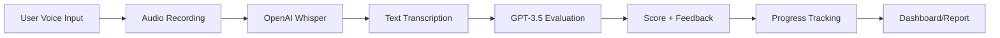

# 🎤 Ai Interview Practice Platform

An AI-powered voice-based interview practice platform that helps you prepare for technical interviews by recording and evaluating your spoken answers.


## 🚀 Live Demo

https://ai-interview--simulator.streamlit.app/

## ✨ Features

### 🎤 Voice-First Practice
- **Voice-only answers** - Practice speaking like real interviews
- **Real-time audio recording** - Built-in microphone support
- **AI Transcription** - Convert speech to text using OpenAI Whisper
- **No typing required** - Focus on verbal communication skills

### 🤖 AI-Powered Evaluation
- **Smart scoring** - Get a single overall score (0-100%)
- **Detailed feedback** - Strengths, improvements, and specific suggestions
- **Category-specific evaluation** - Tailored feedback for Data Structures, Algorithms, System Design, and Behavioral questions
- **Demo mode available** - Works without API key

### 📊 Progress Tracking
- **Dashboard** - Track completed vs attempted questions
- **Score history** - Monitor improvement over time
- **Category performance** - Identify strengths and weaknesses
- **PDF reports** - Download detailed progress reports

### 🎯 Interview Questions
- **10 Common Questions** across 4 categories:
  - **Data Structures** (Array vs Linked List, Stack vs Queue, B-trees vs BST)
  - **Algorithms** (Binary Search, Hash Tables, Dynamic Programming)
  - **System Design** (URL Shortener, Chat Application)
  - **Behavioral** (Challenging Projects, Conflict Resolution)

##  Architecture



## 🛠️ Installation

### Prerequisites
- Python 3.8+
- OpenAI API key (for full features)
- Microphone (for voice recording)

### Local Setup

1. **Clone the repository**

2. **Create virtual environment**
```bash
python -m venv venv
# On Windows
venv\Scripts\activate
# On Mac/Linux
source venv/bin/activate
```

3. **Install dependencies**
```bash
pip install -r requirements.txt
```

4. **Set up API key**
   - Create `.streamlit/secrets.toml` file:
   ```toml
   OPENAI_API_KEY = "your-openai-api-key-here"
   ```
   OR
   - Create `.env` file:
   ```
   OPENAI_API_KEY=your-openai-api-key-here
   ```

5. **Run the application**
```bash
streamlit run app.py
```

## ☁️ Deployment to Streamlit Cloud

### Step 1: Prepare GitHub Repository
1. Create a new repository on GitHub
2. Push your code:
```bash
git init
git add app.py requirements.txt .gitignore
git commit -m "Initial commit"
git branch -M main
git remote add origin https://github.com/YOUR-USERNAME/YOUR-REPO-NAME.git
git push -u origin main
```

### Step 2: Deploy to Streamlit Cloud
1. Go to [share.streamlit.io](https://share.streamlit.io)
2. Sign in with GitHub
3. Click "New app"
4. Select repository, branch, and main file path (`app.py`)
5. Click "Advanced settings"
6. Add your OpenAI API key in Secrets:

### Step 3: Configure Secrets on Streamlit Cloud
In your app settings → "Secrets", add:
```toml
OPENAI_API_KEY = "sk-your-actual-openai-api-key-here"
```

### Step 4: Access Your App
Your app will be available at: `https://your-repo-name.streamlit.app`

## 📁 Project Structure

```
Ai-interview-practice/
├── app.py                    # Main application file
├── requirements.txt          # Python dependencies
├── .gitignore               # Git ignore rules
├── .streamlit/
│   └── secrets.toml         # Local secrets (DO NOT COMMIT)
├── README.md                # This file
└── assets/                  # Optional: images, icons, etc.
```

## 🔧 Configuration

### API Key Setup Options

| Method | Location | Use Case |
|--------|----------|----------|
| **Streamlit Secrets** | `.streamlit/secrets.toml` | Local development |
| **Environment Variable** | `.env` file | Local development |
| **Streamlit Cloud** | App Settings → Secrets | Production deployment |
| **Manual Input** | App sidebar | Temporary testing |

### Environment Variables
- `OPENAI_API_KEY`: Your OpenAI API key (starts with `sk-`)
- Demo mode works without API key (simulated responses)

## 🎮 How to Use

### 1. Start Practicing
1. Navigate to "Practice" page
2. Select a question from dropdown
3. Read the question and key concepts

### 2. Record Your Answer
1. Click "🎤 Start Recording"
2. Allow microphone access
3. Speak your answer clearly
4. Click stop when done

### 3. Transcribe & Evaluate
1. Click "🎤 Transcribe Audio" to convert speech to text
2. Review your transcribed answer
3. Click "✅ Evaluate Answer" for AI feedback
4. View your score and detailed feedback

### 4. Track Progress
1. Check "Dashboard" for overall statistics
2. Monitor scores by category
3. Download PDF reports for review

## 🤝 Contributing

Contributions are welcome! Please feel free to submit a Pull Request.

1. Fork the repository
2. Create your feature branch (`git checkout -b feature/AmazingFeature`)
3. Commit your changes (`git commit -m 'Add some AmazingFeature'`)
4. Push to the branch (`git push origin feature/AmazingFeature`)
5. Open a Pull Request

## 📄 License

This project is licensed under the MIT License - see the [LICENSE](LICENSE) file for details.

## ⚠️ Important Notes

### Security
- **Never commit API keys** to version control
- Use `.gitignore` to exclude secret files
- Streamlit Cloud provides secure secret management

### Limitations
- Requires OpenAI API credits for transcription/evaluation
- Audio recording quality depends on microphone
- Internet connection required for AI features

### Cost Considerations
- Whisper API: $0.006 per minute of audio
- GPT-3.5 API: ~$0.002 per 1K tokens
- Demo mode available for free testing

## 🆘 Support


- **Documentation**: Check this README
- **Contact**: Your email or GitHub profile

## 🙏 Acknowledgments

- [OpenAI](https://openai.com) for GPT and Whisper APIs
- [Streamlit](https://streamlit.io) for the amazing framework
- [FPDF](https://pyfpdf.github.io/fpdf2/) for PDF generation
- All contributors and users

---

Made with ❤️ for technical interview preparation

**Happy Practicing! 🎤💻🚀**
